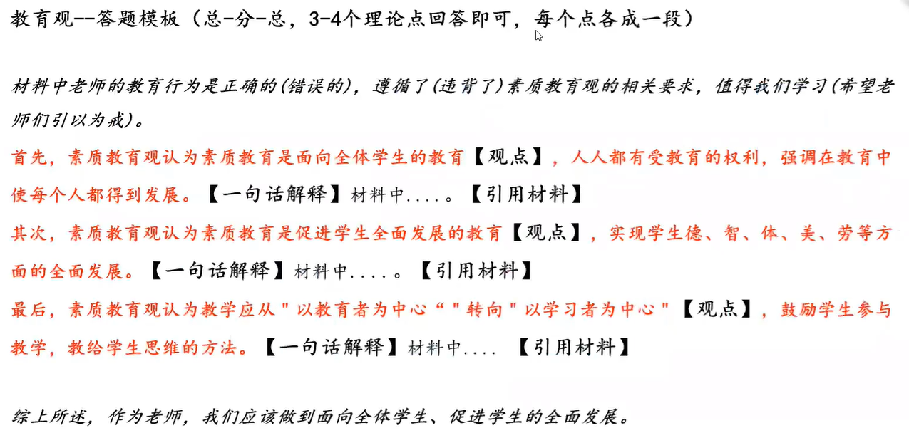
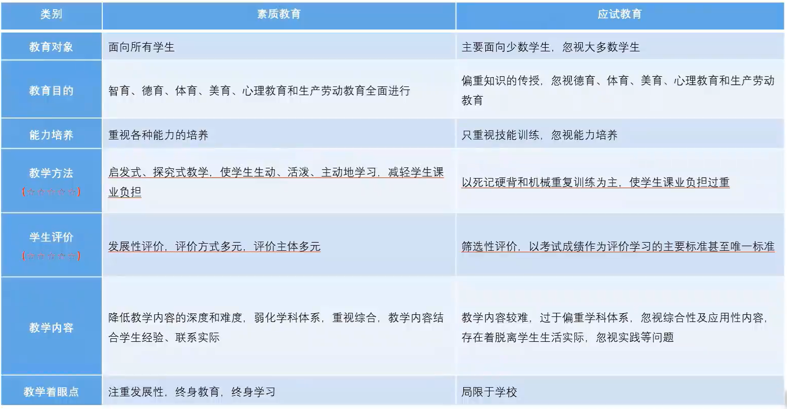
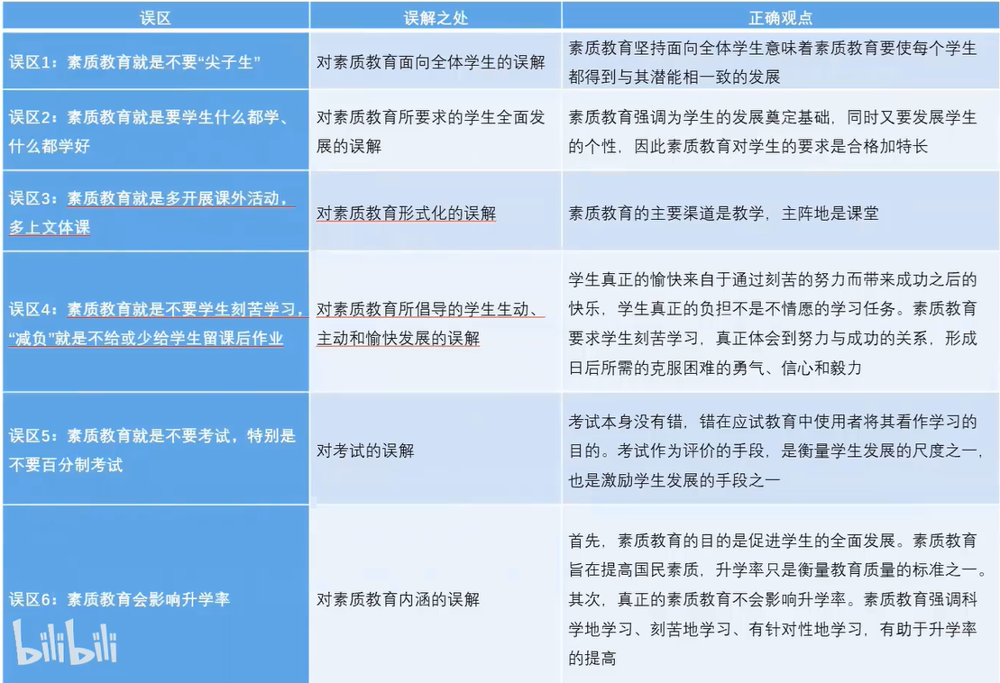
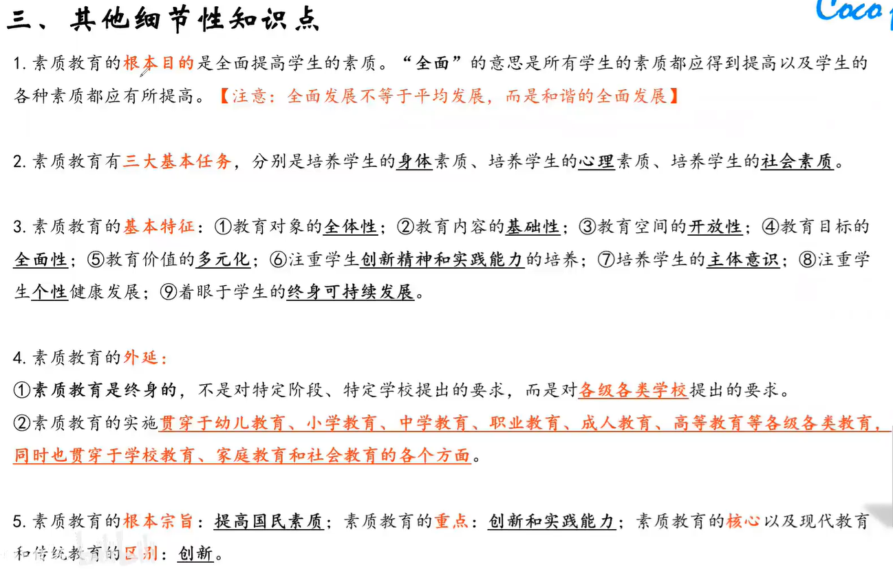

# 一、职业理念

## 1.1 教育观

### 1.1.1素质教育的基本内涵

1. 素质教育以**提**高国民**素**质为根本宗旨的教育
2. 素质教育是面向**全体**学生的教育
3. 素质教育是促进学生**全面**发展的教育
4. 素质教育是促进学生**个性**发展的教育
5. 素质教育是以培养学生的**创**新精神和实践能力为重点的教育

- **提素个性创两全**

### 1.1.2新课改下的教学观

1. 教学从“以教育者为中心”转向“**学**习者为中心”转变
2. 教学从“教会学生知识“转向“教会学生学**习**“转变
3. 教学从“重结论轻过程转向重结论更重**过**程”转变
4. 教学从“关注学科”转向“关注**人**”转变

- 四个转变：**学习过人**

例题：

>  材料分析题（2012上）
> 
> 星期二的早上，天上下起了鹅毛大雪。王老师走进教室，笑容满面地对同学们说:“大家看，外面的雪景多漂亮!今天这节语文课让我们一起走进雪的世界，好好玩下吧!”学生们欢呼雀跃，奔向门外。他们有的堆雪人，有的打雪仗，有的在讨论雪花的形状、特点，王老师也和学生一起观雪、玩雪，即兴吟诗作对………下课时间快要到了，王老师召集大家说:“下午作文课的任务是写一篇记叙文，我相信大家能够出色地完成任务。”后来，学生们根据自己的感受，写出了一篇篇精彩的作文。
问题：请从教育观的角度，评析王老师的教学行为。（14分）
> 
> 提速个性创两全+学习过人
> 
> 答：材料中的老师的教育行为是正确的，遵循了素质教育观的相关要求，值得我们学习。
> 
> 首先，素质教育观认为素质教育是培养学生的创新精神和实现能力的教育，在教学过程中，老师因发挥发挥积极能动性，鼓励学生创新能力和实践能力。材料中王老师的教学活动中，很好的发挥学生的主观能动性，引导学生发现、讨论和实践，因此获得了较好的教学效果。
> 
> 其次，在新课改下的教育观要求从“教育者为中心”转向“学习者为中心”转变，学生是学习主体，教师是学习的引导者。材料中，王老师要求学生观雪，并以自己的感受写文章，正体现了该点。
> 
> 最后，新课改下的教育观要求从“教会学生知识”转向“教会学生学习”转变，从教学法中，教师应多使用启发式教学，探究教学，让学生主动学习。材料中王老师组织学生观雪，玩雪，使得学生更加主动地学习，很好的体现了启发性教学，同时巧妙利用了下雪天气，从传统教学中转向实际生活，让学生能过联系实际。
> 
> 综上所述，作为教师应践行素质教育观，培养学生创新精神和实践能力，以学生为中心，教会学生学习，使得学生学习能过联系实践。
> 
> 

### 1.1.3素质教育和应试教育的区别（选择）

 

### 1.1.4实施素质教育容易出现的误区（选择）

### 1.1.5其他知识点

***

## 1.2 学生观

### 1.2.1 学生观主要内容

1. 学生**独**立意义的人
   - 学生具有个体独立性，不以教师意志为移动
   - 学生具有独立意义的主体，不以教师的意志为移动
   - 学生是责权的主体
2. 学生是**独**特的人
   - 学生是完整的人
   - 每个学生具有自身的独特性
   - 学生与成人之前存在巨大差异
3. 学生是**发**展的人
   - 学生的身心发展是有规律的
   - 学生具有巨大发展潜能
   - 学生是处于发展过程中的人
4. **全**面发展：德智体美劳全面发展
5. 面向**全**体学生：公平公正对待每个学生，不能偏爱某个学

- **两独一发+两全**

***

## 1.3 教师观