# 一、Duilib简介

[Duilib](https://github.com/duilib/duilib)是一个Windows下免费开源的DirectUI界面库，由于简约易扩展的设计以及稳定高效的实现被各大互联网公司普遍接受，广泛应用于包括IM、视频客户端、股票行情软件、导航软件、手机辅助软件、安全软件等多个行业的众多pc客户端软件。Duilib还在不断的发展中，在文档、例子、动画、渲染引擎等多个方面将持续改进。

# 二、Duilib编译

## 1. 动态编译

1. 下载源码后，打开**Duilib**目录，使用Visual Studio打开项目**DuiLib.vcxproj**。

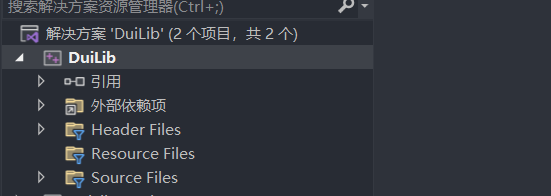

2. 修改平台工具集，打开项目属性，在**配置属性——常规——平台工具集** 修改为使用的平台版本。

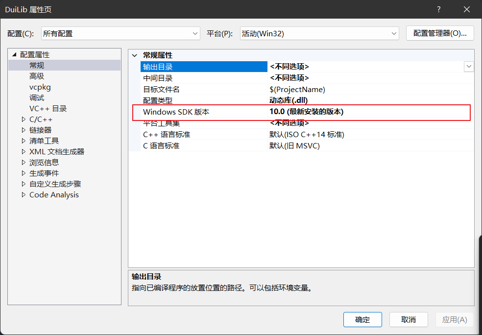

2. 修改字符集，打开项目属性，在**配置属性——高级——字符集** 修改为对应**多字节字符集**。

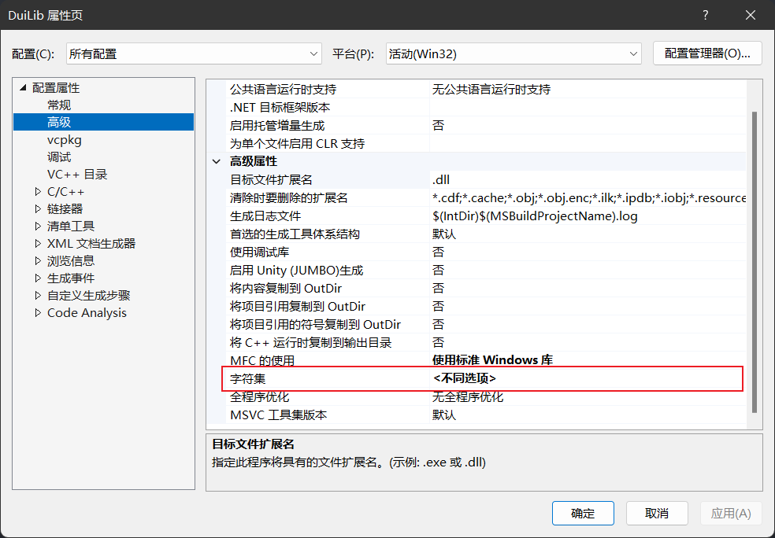

2. 对项目生成解决方案。最后得到**Duilb_d.dll**和**Duilib_d.lib**两个文件。

## 2. 静态编译

源码中，仅有一个 **DuiLib_Static.vcxproj**的项目文件，没有**DuiLib_Static.vcxproj.filters **的文件目录树描述文件。没关系，我们直接复制一份 **Duilib.vcxproj.filters **文件改名为 Duil**ib_Static.vcxproj.filters **即可，这个文件只是描述在 vs 中看到的文件目录结构，静态库和动态库都使用一样的目录树即可。修改完成后是下面这幅图的样子：

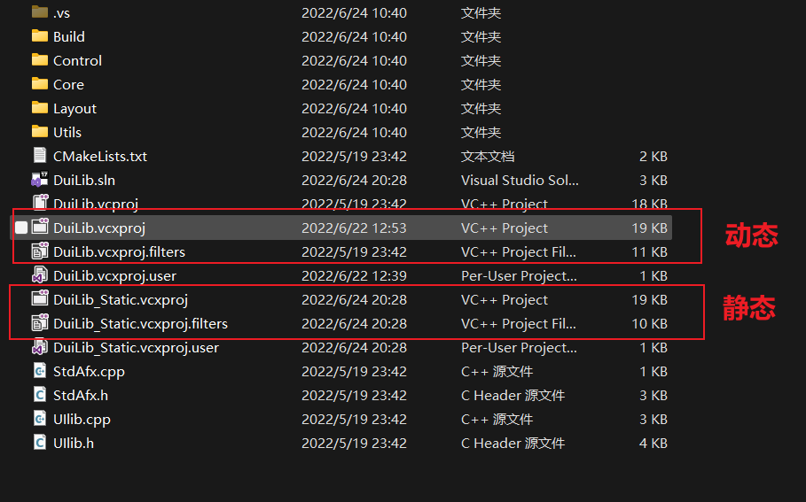

<br/>

1. 使用Visual Studio打开项目**DuiLib_Static.vcxproj** 

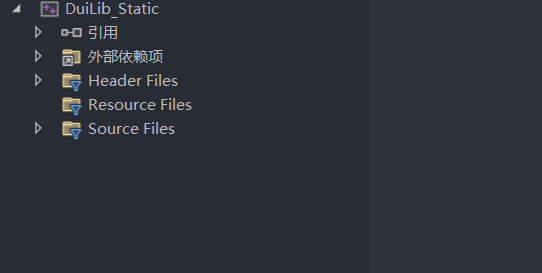

2. 修改平台工具集，打开项目属性，在**配置属性——常规——平台工具集** 修改为使用的平台版本。

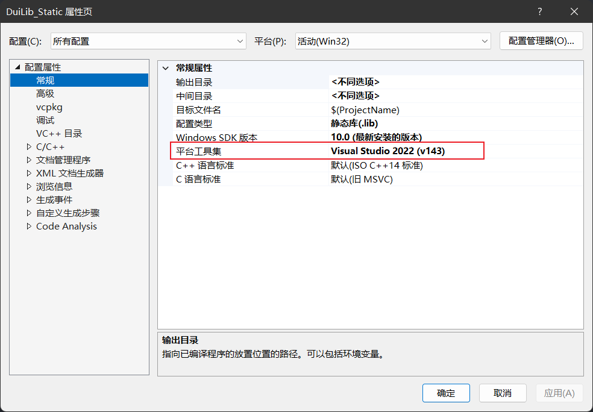

3. 修改字符集，打开项目属性，在**配置属性——高级——字符集** 修改为对应**多字节字符集**。

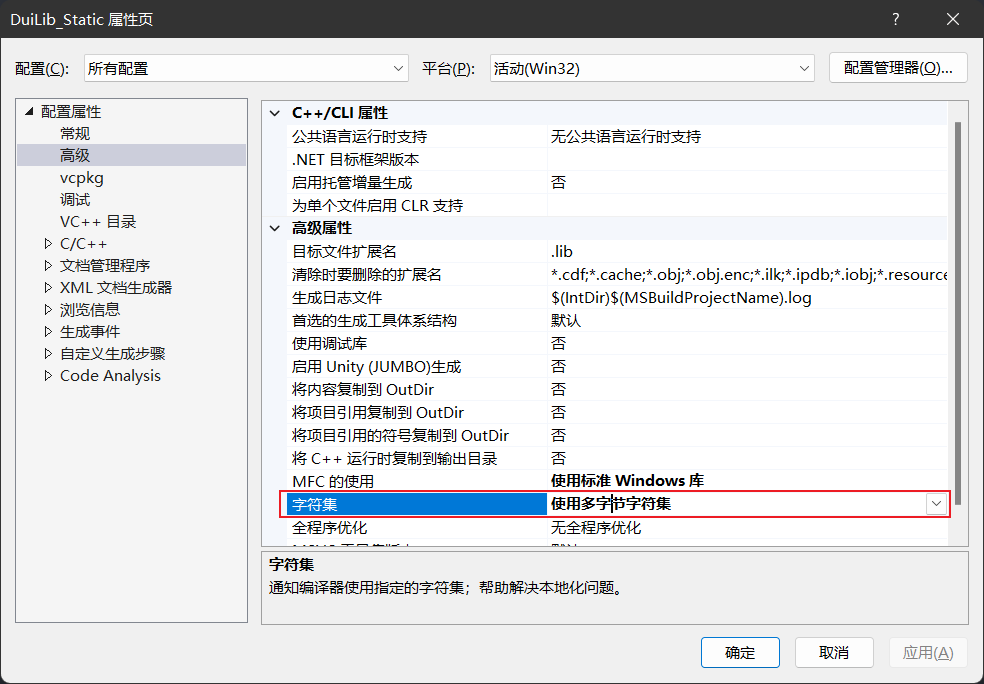

4. 对项目生成解决方案。最后得到**DuiLib_Static_d.lib**静态库文件。

# 三、使用

```c_cpp
// Duilib使用设置部分
#pragma once

#define WIN32_LEAN_AND_MEAN
#define _CRT_SECURE_NO_DEPRECATE

#include <objbase.h>
#include <windows.h>


#include "UIlib.h"

using namespace DuiLib;


// 窗口实例及消息响应部分
class CFrameWindowWnd : public CWindowWnd, public INotifyUI {
 public:
  CFrameWindowWnd(){};
  LPCTSTR GetWindowClassName() const { return _T("UIMainFrame"); };
  UINT GetClassStyle() const { return UI_CLASSSTYLE_FRAME | CS_DBLCLKS; };
  void OnFinalMessage(HWND /*hWnd*/) { delete this; };

  void Notify(TNotifyUI& msg) {
    if (msg.sType == _T("click")) {
      if (msg.pSender->GetName() == _T("closebtn")) {
        Close();
      }
    }
  }

  LRESULT HandleMessage(UINT uMsg, WPARAM wParam, LPARAM lParam) {
    if (uMsg == WM_CREATE) {
      m_pm.Init(m_hWnd);
      CControlUI* pButton = new CButtonUI;
      pButton->SetName(_T("closebtn"));
      pButton->SetBkColor(0xFFFF0000);
      m_pm.AttachDialog(pButton);
      m_pm.AddNotifier(this);
      return 0;
    } else if (uMsg == WM_DESTROY) {
      ::PostQuitMessage(0);
    }
    LRESULT lRes = 0;
    if (m_pm.MessageHandler(uMsg, wParam, lParam, lRes)) return lRes;
    return CWindowWnd::HandleMessage(uMsg, wParam, lParam);
  }

 public:
  CPaintManagerUI m_pm;
};

// 程序入口及Duilib初始化部分
int APIENTRY WinMain(HINSTANCE hInstance, HINSTANCE /*hPrevInstance*/,
                     LPSTR /*lpCmdLine*/, int nCmdShow) {
  CPaintManagerUI::SetInstance(hInstance);
  CPaintManagerUI::SetResourcePath(CPaintManagerUI::GetInstancePath());

  CFrameWindowWnd* pFrame = new CFrameWindowWnd();
  if (pFrame == NULL) return 0;
  pFrame->Create(NULL, _T("测试"), UI_WNDSTYLE_FRAME, WS_EX_WINDOWEDGE);
  pFrame->ShowWindow(true);
  CPaintManagerUI::MessageLoop();

  return 0;
}
```

## 1.动态库使用

1. 将Duilib源码添加到项目中，打开项目属性，在**配置属性——VC++目录——包含目录**，添加源代码的目录（需要使用的头文件）。

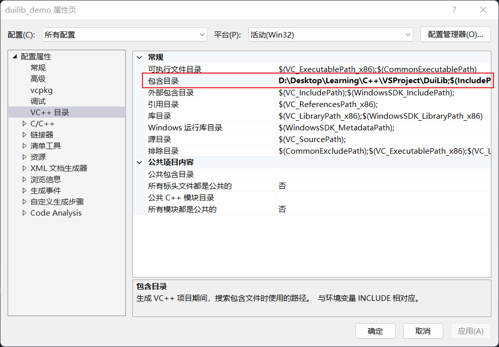

2. 将编译生成的Duilib库文件添加到项目中，打开项目属性，在**链接器——常规——附加库目录**，中添加**Duilib_d.lib**所在的目录。

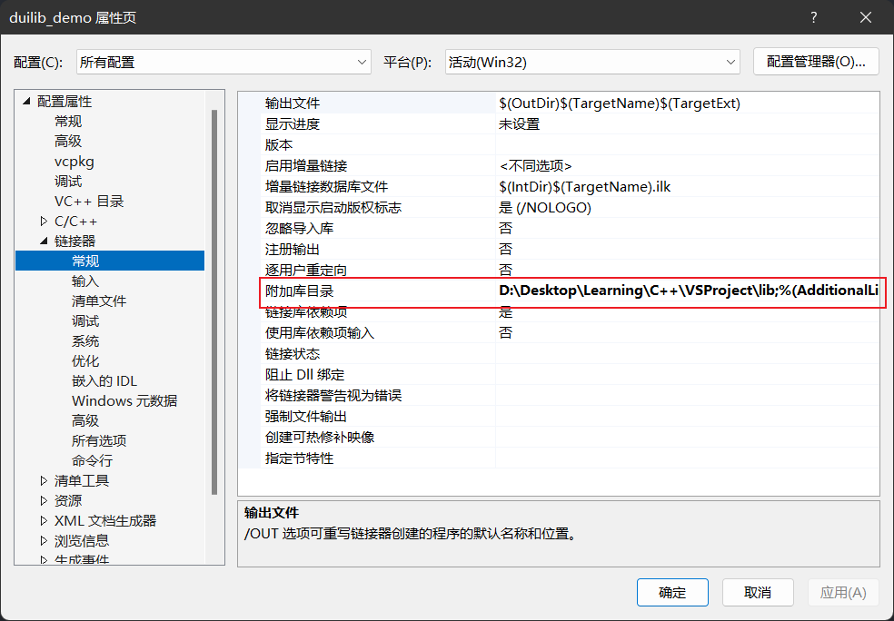

3. 设置项目附加依赖项（所需使用的库），打开项目属性，在**链接器——输入——附加依赖项**，添加需要使用的库名即**Duilib_d.lib**

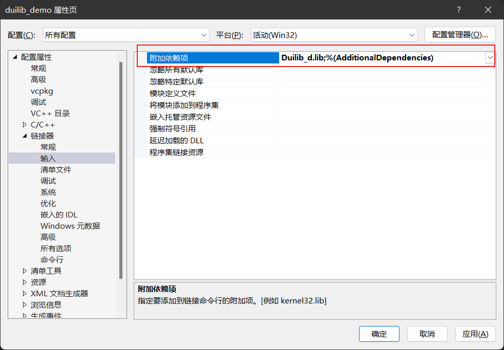

4. 生成解决方法，得到**.exe**文件，但还是无法运行，需要将动态库生成的另一个文件**Duilib_d.dll**与可执行文件放在相同路径下，才能执行。

## 2.静态库使用

1. 生成Duilib静态库后，使用的前三个步骤与动态库一样，添加源代码，设置库目录，设置附加依赖项。
2. 设置静态变量，打开项目属性，在**C/C++——预处理器——预处理器定义**，中添加变量**UILIB_STATIC**，如下图所示。

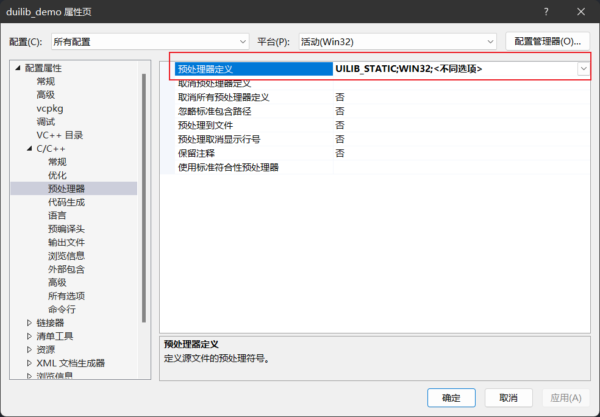

3. 此时生成解决方案还是会出错，还需设置运行库，打开项目属性，在**C/C++——代码生成——运行库**，设置为多线程调试，如下图所示

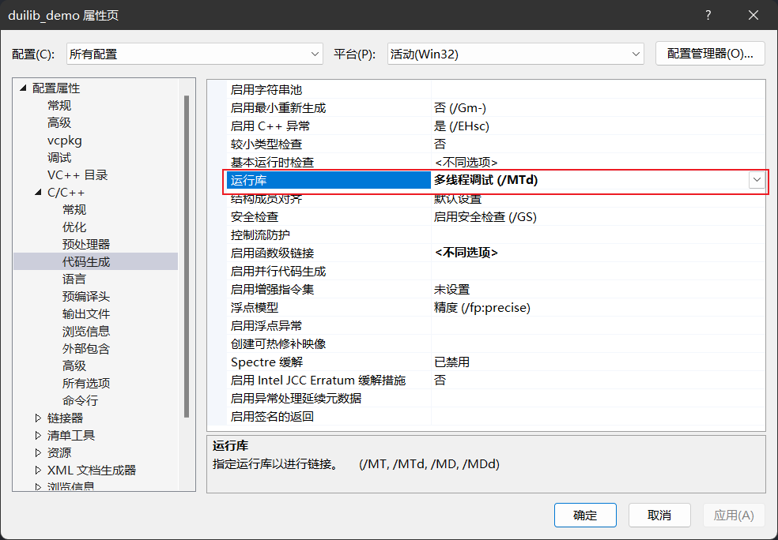

4. 最后生成解决方案，得到**exe**可执行文件，直接运行即可。