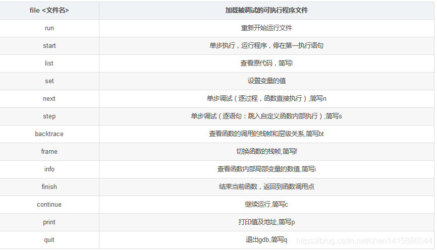

# GDB调试

##  1. 前言

GDB（GNU Debugger）是UNIX及UNIX-like下的强大调试工具，可以调试ada, c, c++, asm, minimal, d, fortran, objective-c, go, java,pascal等语言。本文以C程序为例，介绍GDB启动调试的多种方式.

## 2. 简介

UNIX及UNIX-like下的调试工具。虽然它是命令行模式的调试工具，但是它的功能强大到你无法想象，能够让用户在程序运行时观察程序的内部结构和内存的使用情况。

一般来说，GDB主要帮助你完成下面四个方面的功能：

> 1、按照自定义的方式启动运行需要调试的程序。
2、可以使用指定位置和条件表达式的方式来设置断点。
3、程序暂停时的值的监视。
4、动态改变程序的执行环境。

<br/>

## 3. 哪些文件可以使用GDB

1. 要调试C/C++的程序，首先在编译时，要使用gdb调试程序，在使用gcc编译源代码时必须加上“-g”参数。保留调试信息，否则不能使用GDB进行调试。

```
#带有调试信息
$ gdb helloworld
Reading symbols from helloWorld...(no debugging symbols found)...done.
#不带调试信息
$ gdb helloworld
no debugging symbols found。

```

2.  core dump 文件（暂时未使用）

- core dump又叫核心转储, 当程序运行过程中发生异常, 程序异常退出时, 由操作系统把程序当前的内存状况存储在一个core文件中, 叫core dump. (linux中如果内存越界会收到SIGSEGV信号，然后就会core dump)
- 首先通过ulimit命令查看一下系统是否配置支持了dump core的功能。通过ulimit -c或ulimit -a，可以查看core file大小的配置情况，如果为0，则表示系统关闭了dump core。可以通过ulimit -c unlimited来打开。
- sudo echo /usr/share/corefile/core-%e-%p > /proc/sys/kernel/core_pattern 设置存放位置，主要需要有权限访问

```
$gdb 可执行文件名 coredump文件
```

## 4. 基本命令



## 5.打断点

- 通过行号打断点

>  ` break [行号]`