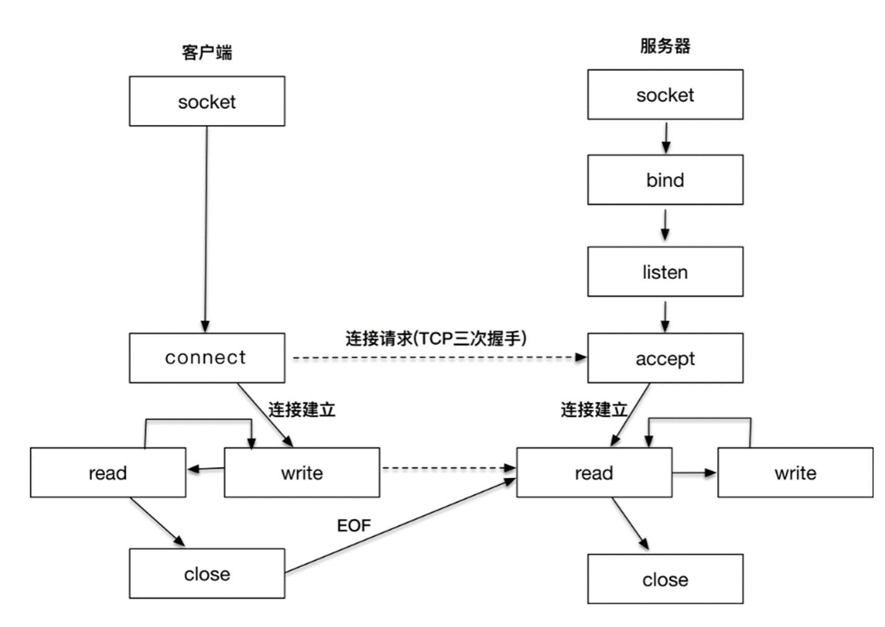

# 1.基础概念

1. Socket
套接字。对网络中不同主机上的应用进程之间进行双向通信的端点的抽象。
例子：客户端将数据通过网线发送到服务端，客户端发送数据需要一个出口，服务端接收数据需要一个入口，这两个“口子”就是Socket。

2. FD：file descriptor
文件描述符，非负整数。“一切皆文件”，linux 中的一切资源都可以通过文件的方式访问和管理。而 FD 就类似文件的索引（符号），指向某个资源，内核（kernel）利用 FD 来访问和管理资源。

3. 例子

例子：你是一个老师，让学生做作业，学生做完作业后收作业。
同步阻塞：逐个收作业，先收A，再收B，接着是C、D，**如果有一个学生还未做完，则你会等到他写完**，然后才继续收下一个。
同步非阻塞：逐个收作业，先收A，再收B，接着是C、D，**如果有一个学生还未做完，则你会跳过该学生**，继续去收下一个。
select/poll：学生写完了作业会举手，但是你**不知道是谁举手，需要一个个的去询问**。
epoll：**学生写完了作业会举手，你知道是谁举手，你直接去收作业**。