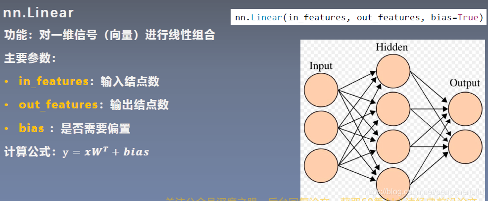

# pytorch使用

## Dataset类

该类为抽象类用于处理数据的读取，该类重载了一下操作符，用于数据处理，然后返回PIL格式的图片。

`from torch.utils.data import Dataset`导入

- 使用案例

```python
from torch.utils.data import Dataset
from PIL import Image
import os


class MyData(Dataset):
    def __init__(self, root_dir, label_dir):
        self.root_dir = root_dir
        self.label_dir = label_dir
        self.path = os.path.join(self.root_dir, self.label_dir)
        self.img_paths = os.listdir(self.path)

    def __getitem__(self, idx):
        img_name = self.img_paths[idx]
        img_item_path = os.path.join(self.root_dir, self.label_dir, img_name)
        img = Image.open(img_item_path)
        label = self.label_dir
        return img, label

    def __len__(self):
        return len(self.img_paths)


# 路径
root_dir = "dataset/train"
ants_label_dir = "ants"
bees_label_dir = "bees"
# 创建数据集
ants_dataset = MyData(root_dir, ants_label_dir)
bees_dataset = MyData(root_dir, bees_label_dir)
# 合拼数据集
train_dataset = ants_dataset + bees_dataset
# 直接使用【】符合取值 该类重载了【】符合
print(train_dataset[0])

```

## Transforms 工具

改用**图片（PIL，、numpy.array）**转换冲**tensor类型图片**

`from torchvision import transforms`  导入

1. 使用案例

```python
from torchvision import transforms
from PIL import Image

img_path = r"C:\Users\10451\Desktop\Learning\Python\learn_pytorch\dataset\train\ants\0013035.jpg"
img_PIL = Image.open(img_path)
img_to_tensor = transforms.ToTensor() #实例化转换类
tensor_img = img_to_tensor(img_PIL) # 调用转换输出结果

```

2. 常用类
   
   Compose类，将将一系列转换方式作为列表，然后逐一应用到图片中
   ```python
   trans_to_tensor = transforms.ToTensor() 
   trans_resize = transforms.Resize((512, 512))
   # 对图进行resize和totensor
   trans_compose = transforms.Compose([trans_resize, trans_to_tensor])
   img_compose = trans_compose(img_PIL)
   ```
   
   Totensor类，将图片转换为tensor图片，使用如下：
   ```python
   # Totensor
   trans_to_tensor = transforms.ToTensor()
   img_tensor = trans_to_tensor(img_PIL)
   writer.add_image("Tensor", img_tensor)
   ```
   
   Normlize类，将tensor图片进行归一化，便于之后处理。使用如下
   ```python
   trans_norm = transforms.Normalize([1, 2, 3], [3, 2, 1])
   img_norm = trans_norm(img_tensor)
   ```
   
   原始tensor图片
   
   

使用Normalize后图片


## tensorboard 使用

TensorBoard是一个可视化工具，它可以用来展示网络图、张量的指标变化、张量的分布情况等。特别是在训练网络的时候，我们可以设置不同的参数（比如：权重W、偏置B、卷积层数、全连接层数等），使用TensorBoader可以很直观的帮我们进行参数的选择。

```python
##from torch.utils.tensorboard import SummaryWriter
from PIL import Image
import numpy as np

# 实例化
writer = SummaryWriter()
img_path = "dataset/train/bees/16838648_415acd9e3f.jpg"
img_PIL = Image.open(img_path)
# 讲PIL图片转换为numpy.array格式图片
img_nparray = np.array(img_PIL)
# 添加图片
writer.add_image("test", img_nparray, 2, dataformats='HWC')
# 设置图表
for i in range(100):
    writer.add_scalar("2y=x", 2*i, i)

writer.close()

```

<br/>

## torchvision使用

[torchvision](https://pytorch.org/vision/stable/index.html)官方数据集

```python
# 使用官网数据集
# 第一个参数数据存放位置，第二参数是否是训练集True是False不是，transform=制定需要的转换方法，download表示重官网下载
# 若无法下载这复制链接使用下载器下载，然后解压到对应的存放路径
train_dataset = torchvision.datasets.CIFAR10("./CIFAR10", True, transform=dataset_transforms, download=True)
test_dataset = torchvision.datasets.CIFAR10("./CIFAR10", False, transform=dataset_transforms, download=True)
```

## Dataloader使用

其作用是从数据集中取出数据装载到神经网络中。

`from torch.utils.data import DataLoader`导入

```python
# dataloader
第一参数设置数据集，batch_size每次取多少，shuffle是否随机取，drop_last当图片不够batch_size是是否丢弃
test_dataloader = DataLoader(dataset=test_dataset, batch_size=64, shuffle=False, drop_last=True)
```

<br/>

## NN(Neural Network) 神经网络库使用

`from torch import nn` 导入

通常使用其Module类，继承该类，并进行重写，如下方使用案例

```python
import torch
from torch import nn


class MyModule(nn.Module):
    def __init__(self):
        super().__init__()

    # 需要该方法，当调用该类时，会自动执行forward函数
    def forward(self, input):
        return input + 2


# 实例化模型
module = MyModule()
# 创建tensor对象
x = torch.tensor(1.0)
# 将tensor对象传入神经网络，返回输出
output = module(x)
print(output)
```

### 卷积convolution

卷积是一种积分运算，用来求两个曲线重叠区域面积。 可以看作加权求和，可以用来消除噪声、特征增强。

`import torch.nn.functional as F` 导入，简短使用

```python
input = torch.tensor([[1, 2, 0, 3, 1],
                      [0, 1, 2, 3, 1],
                      [1, 2, 1, 0, 0],
                      [5, 2, 3, 1, 1],
                      [2, 1, 0, 1, 1]])

kernel = torch.tensor([[1, 2, 1],
                       [0, 1, 0],
                       [2, 1, 0]])
# 重新设置tensor大小，第一个为维度，第二个为batchsize,第三和第四位tensor宽高
input = torch.reshape(input, (1, 1, 5, 5))
kernel = torch.reshape(kernel, (1, 1, 3, 3))
# 对input通过kernel进修卷积，stride表示每一卷积不步进，padding=将会对input边缘进行填充
output = F.conv2d(input, kernel, stride=1)
```

dataset+dataloader+nn+tensorboard使用案例

```python
import torch
import torchvision
from torch.utils.data import DataLoader
from torch import nn
from torch.utils.tensorboard import SummaryWriter

dataset = torchvision.datasets.CIFAR10("./CIFAR10", train=False, transform=torchvision.transforms.ToTensor(), download=True)

dataloader = DataLoader(dataset, batch_size=64, shuffle=True, drop_last=True)

# 定义自己nn
class MyModule(nn.Module):
    def __init__(self):
        super(MyModule, self).__init__()
        self.conv1 = nn.Conv2d(in_channels=3, out_channels=6, kernel_size=3, stride=1, padding=0)

    def forward(self, input):
        output = self.conv1(input)
        return output


module = MyModule()
print(module)

# 使用dataloader取出数据，放入到神经网络中,然后将输入和输入图片放入到tensorboard中战术
step = 0
writer = SummaryWriter("logs")
for data in dataloader:
    imgs, tagets = data
    output = module(imgs)
    # torch.Size([64, 3, 32, 32])
    print(imgs.shape)
    # torch.Size([65, 3, 30, 30])
    print(output.shape)
    writer.add_images("input", imgs, step)
    output = torch.reshape(output, [-1, 3, 30, 30])
    writer.add_images("output", output, step)
    step = step + 1
```

### 池化 pooling

最大池化，根据池化核大小在原始图片中取出最大的数据，作为输出(总而言之，池化操作，就是以偏概全，缩小数据量)。案例如下


使用案例：

```python
import torch
import torchvision
from torch.utils.data import DataLoader
from torch import nn
from torch.utils.tensorboard import SummaryWriter


class MyModule(nn.Module):
    def __init__(self):
        super().__init__()
        self.maxpool1 = nn.MaxPool2d(kernel_size=3, ceil_mode=False)

    def forward(self, input):
        output = self.maxpool1(input)
        return output

# 官方数据集
dataset = torchvision.datasets.CIFAR10("./CIFAR10", True, transform=torchvision.transforms.ToTensor(), download=True)
# 加载数据集
dataloader = DataLoader(dataset, batch_size=64, shuffle=True, drop_last=False)
# 初始化tensorboard工具
writer = SummaryWriter("logs")
module = MyModule()
step = 0
# 将遍历dataloader,将每一个组数据进行池化，并添加到tensorboard可视化
for data in dataloader:
    imgs, targets = data
    writer.add_images("input", imgs, step)
    output = module(imgs)
    writer.add_images("output", output, step)
    step += 1

writer.close()
```


### 非线性激活层(Non-linear Activations)

简单地说，激活函数就是加入到人工神经网络中的一个函数，目的在于帮助神经网络从数据中学习复杂模式。引入激活函数是为了增加神经网络模型的非线性。没有激活函数的每层都相当于矩阵相乘。就算你叠加了若干层之后，无非还是个矩阵相乘罢了。

sigmoid使用案例：

```python
import torch

# 非线性激活
import torchvision
from torch import nn
from torch.utils.data import DataLoader
from torch.utils.tensorboard import SummaryWriter

dataset = torchvision.datasets.CIFAR10('./CIFAR10', train=False, transform=torchvision.transforms.ToTensor(),
    download=True)

dataloader = DataLoader(dataset, batch_size=64)


class MyModule(nn.Module):
    def __init__(self):
        super().__init__()
        self.relu1 = nn.ReLU(inplace=False)
        self.sigmoid1 = nn.Sigmoid()

    def forward(self, input):
        output = self.sigmoid1(input)
        return output


writer = SummaryWriter("logs")
step = 0
module = MyModule()
for data in dataloader:
    imgs, targets = data
    writer.add_images("input", imgs, step)
    output = module(imgs)
    writer.add_images("output", output, step)
    step += 1

writer.close()

```

效果可视化：


### 线性层(Linear Layers)

在pytorch中，全连接层又叫线性层。



Liner使用案例：

```python
import torch
import torchvision
from torch import nn
from torch.utils.data import DataLoader

dataset = torchvision.datasets.CIFAR10('./CIFAR10', train=False, transform=torchvision.transforms.ToTensor(),
    download=True)

dataloader = DataLoader(dataset, batch_size=64, drop_last=True)


# liner层
class Mymodule(nn.Module):
    def __init__(self):
        super(Mymodule, self).__init__()
        self.linser1 = nn.Linear(196608, 10)

    def forward(self, input):
        output = self.linser1(input)
        return output


module = Mymodule()
for data in dataloader:
    imgs, targets = data
    print("original imgs", imgs.shape)
    # 将数据展平
    imgs = torch.flatten(imgs)
    print("flatten", imgs.shape)
    output = module(imgs)
    print("output", output.shape)

```

### nn神经网络简单案例


```python
import torch
from torch import nn
from torch.utils.tensorboard import SummaryWriter


class MyModule(nn.Module):
    def __init__(self):
        super(MyModule, self).__init__()
        self.module1 = nn.Sequential(# 根据上图搭建网络
            nn.Conv2d(3, 32, kernel_size=5, padding=2),
            nn.MaxPool2d(2),
            nn.Conv2d(32, 32, kernel_size=5, padding=2),
            nn.MaxPool2d(2),
            nn.Conv2d(32, 64, kernel_size=5, padding=2),
            nn.MaxPool2d(2),
            nn.Flatten(),
            nn.Linear(1024, 64),
            nn.Linear(64, 10),
        )

    def forward(self, x):
        return self.module1(x)


module = MyModule()
input = torch.ones((64, 3, 32, 32)) # 测试数据
output = module(input)
print(output.shape)
# 添加图到tensorboard以便观步骤
writer = SummaryWriter("logs")
writer.add_graph(module, input)
writer.close()

```

tensorboard观察模型


### Loss Functions

用于衡量输出和目标的差，该值具有指导作用，根据loss值反向去调整神经网络已到达输出无限接近目标值。loss值越小越好。

常用函数

1. `nn.L1Loss` 差值绝对值jkl
2. `nn.MSELoss` 平方差值
3. `nn.CrossEntropyLoss` 信息熵
4. 使用案例
   ```python
   # 案例一
   import torch
   from torch import nn
   
   output = torch.tensor([1, 2, 3], dtype=torch.float)
   target = torch.tensor([1, 2, 5], dtype=torch.float)
   output = torch.reshape(output, (1, 1, 1, 3))
   target = torch.reshape(target, (1, 1, 1, 3))
   
   # 相差绝对值
   loss = nn.L1Loss()
   result = loss(output, target)
   print(result)
   # MSE 平方差
   loss = nn.MSELoss()
   result = loss(output, target)
   print(result)
   # result
   # tensor(0.6667)
   # tensor(1.3333)
   
   # 案例二
   import torchvision
   from torch import nn
   from torch.utils.data import DataLoader
   
   
   class MyModule(nn.Module):
       def __init__(self):
           super(MyModule, self).__init__()
           self.module1 = nn.Sequential(
               nn.Conv2d(3, 32, kernel_size=5, padding=2),
               nn.MaxPool2d(2),
               nn.Conv2d(32, 32, kernel_size=5, padding=2),
               nn.MaxPool2d(2),
               nn.Conv2d(32, 64, kernel_size=5, padding=2),
               nn.MaxPool2d(2),
               nn.Flatten(),
               nn.Linear(1024, 64),
               nn.Linear(64, 10),
           )
   
       def forward(self, x):
           return self.module1(x)
   
   
   dataset = torchvision.datasets.CIFAR10("./CIFAR10", train=False, transform=torchvision.transforms.ToTensor(),
       download=True)
   
   dataloader = DataLoader(dataset, batch_size=1)
   
   module = MyModule()
   loss_cross = nn.CrossEntropyLoss()
   for data in dataloader:
       imgs, targets = data
       output = module(imgs)
       # 计算出loss值
       result_loss = loss_cross(output, targets)
       # 反向传播
       result_loss.backward() # 在loss值使用函数backward(),打断点查看 gradient 梯度值，后续优惠根据grad进行
       print("ok")
   ```

## optim优化器

`import torch.optim`导入

使用案例

```python

import torch.optim
import torchvision
from torch import nn
from torch.utils.data import DataLoader


class MyModule(nn.Module):
    def __init__(self):
        super(MyModule, self).__init__()
        self.module1 = nn.Sequential(
            nn.Conv2d(3, 32, kernel_size=5, padding=2),
            nn.MaxPool2d(2),
            nn.Conv2d(32, 32, kernel_size=5, padding=2),
            nn.MaxPool2d(2),
            nn.Conv2d(32, 64, kernel_size=5, padding=2),
            nn.MaxPool2d(2),
            nn.Flatten(),
            nn.Linear(1024, 64),
            nn.Linear(64, 10),
        )

    def forward(self, x):
        return self.module1(x)


dataset = torchvision.datasets.CIFAR10("./CIFAR10", train=False, transform=torchvision.transforms.ToTensor(),
    download=True)

dataloader = DataLoader(dataset, batch_size=1)

module = MyModule()
loss_cross = nn.CrossEntropyLoss()
# 创建优化器 传入模型参数，以及学习速率lr
optim = torch.optim.SGD(module.parameters(), lr=0.01)
for epoch in range(3):
    running_loss = 0.0
    for data in dataloader:
        imgs, targets = data
        output = module(imgs)
        result_loss = loss_cross(output, targets)
        optim.zero_grad()  # 使用前将优化器中的grad清零
        result_loss.backward()  # 反向传播根据差值获得grad
        optim.step()  # 进修优化
        running_loss += result_loss
    print("epoch:{0} running_loss {1}".format(epoch, running_loss))
# result
#Files already downloaded and verified
#epoch:0 running_loss 18760.046875
#epoch:1 running_loss 16135.8740234375
#epoch:2 running_loss 15395.2080078125
```

### 指定每一层的学习率

Optimizer也支持为每个参数单独设置选项。若想这么做，不要直接传入Variable的iterable，而是传入dict的iterable。每一个dict都分别定 义了一组参数，并且包含一个param键，这个键对应参数的列表。其他的键应该optimizer所接受的其他参数的关键字相匹配，并且会被用于对这组参数的 优化。

```python
optim.SGD([
                {'params': model.base.parameters()},
                {'params': model.classifier.parameters(), 'lr': 1e-3}
            ], lr=1e-2, momentum=0.9)
```

<br/>

## 使用现有模型

案例：

```python
import torchvision

# ImageNet数据以闭源，需要申请下载,在这使用通过ImageNet预先训练的VGG16
from torch import nn

VGG16 = torchvision.models.vgg16(pretrained=True)  # 使用预先训练的模型,
# 模型下载后存储位置：C:\Users\10451/.cache\torch\hub\checkpoints\vgg16-397923af.pth

# 将原先VGG16的1000个输出通过添加liner层输出10个
VGG16.classifier.add_module("add_liner", nn.Linear(1000, 10))
print(VGG16)
# 单独修改某个
VGG16.classifier[6] = nn.Linear(4096, 10)
print(VGG16)

```

## 模型的保存和加载

```python
import torch
import torchvision

# 创建模型
vgg16 = torchvision.models.vgg16(pretrained=False)
# save
torch.save(vgg16, "./vgg16.model1")  # 方法一：保存完整的模型(模型+参数）
torch.save(vgg16.state_dict(), "./vgg16.model2")  # 方法二：只保存模型的参数

# load
# 方法一对应的加载方式
model = torch.load("./vgg16.model1")
# 方法二对应的加载方式(推荐)
vgg16 = torchvision.models.vgg16(pretrained=False)
vgg16.load_state_dict("./vgg16.model2")

```

## 完整训练套路（CIFAR10为例）

```python
# 完整训练套路CIFAR10为例
import torch.optim
import torchvision
from torch import nn
from torch.utils.data import DataLoader
from torch.utils.tensorboard import SummaryWriter

from model import Classify

train_dataset = torchvision.datasets.CIFAR10(root="../CIFAR10", train=True, transform=torchvision.transforms.ToTensor(),
    download=True)
test_dataset = torchvision.datasets.CIFAR10(root="../CIFAR10", train=False, transform=torchvision.transforms.ToTensor(),
    download=True)

train_dataset_len = len(train_dataset)
test_dataset_len = len(test_dataset)
print("训练集长度为{}".format(train_dataset_len))
print("测试集长度为{}".format(test_dataset_len))

train_dataloader = DataLoader(train_dataset, batch_size=64, shuffle=True, drop_last=True)
test_dataloader = DataLoader(test_dataset, batch_size=64, shuffle=True, drop_last=True)
# 创建网络
model = Classify()
# 损失函数
loss_fnc = nn.CrossEntropyLoss()
# 优化器
learning_rate = 1e-2
optimizer = torch.optim.SGD(model.parameters(), lr=learning_rate)

# 设置训练网络一些参数
total_train_step = 0
total_test_step = 0
epoch = 10
writer = SummaryWriter("../logs_train")
for i in range(epoch):
    print("-" * 10, "第{}轮训练".format(i + 1), "-" * 10)
    model.train()
    for data in train_dataloader:
        imgs, targets = data
        outputs = model(imgs)
        # 计算结果和目标的loss值
        loss = loss_fnc(outputs, targets)
        # 优化器调优
        optimizer.zero_grad()
        loss.backward()
        optimizer.step()
        total_train_step += 1
        if total_train_step % 100 == 0:
            print("训练次数：{}，loss={}".format(total_train_step, loss.item()))
            writer.add_scalar("train_loss", loss.item(), total_train_step)

    # 测试数据集
    model.eval()
    total_test_loss = 0
    total_accuracy = 0
    with torch.no_grad():  # 关闭梯度，测试不需要
        for data in test_dataloader:
            imgs, targets = data
            outputs = model(imgs)
            loss = loss_fnc(outputs, targets)
            total_test_loss += loss
            # 正确率
            # outputs.argmax(1)每个输出都是一个tensor，取出概率最大值的位置与target对比是否成功，然后sum计算当前的正确次数
            accuracy = (outputs.argmax(1) == targets).sum()
            total_accuracy += accuracy

    print("整体测试集的Loss={}".format(total_test_loss))
    print("整体测试集的正确率={}".format(total_accuracy / test_dataset_len))
    writer.add_scalar("total_test_loss", total_test_loss, total_test_step)
    writer.add_scalar("total_accuracy", total_accuracy, total_test_step)
    total_test_step += 1
    # 保存每一轮训练结果
    torch.save(model.state_dict(), "model_{}.pth".format(i))
    print("模型已保存")
writer.close()

```

使用GPU加速需要对一下三个数据进行设置

1. 模型  
2. 损失函数
3. 数据(输入和targets)
   ```python
   # 方式一
   # 创建网络
   model = Classify()
   if torch.cuda.is_available():
       model = model.cuda()  # 使用GPU
   # 损失函数
   loss_fnc = nn.CrossEntropyLoss()
   if torch.cuda.is_available():
       loss_fnc = loss_fnc.cuda()  # 使用GPU
   
   if torch.cuda.is_available():
       imgs = imgs.cuda()  # 使用GPU
       targets = targets.cuda()  # 使用GPU
       
   #方式二
   # 定义运行的设备
   device = torch.device("cuda" if torch.cuda.is_available() else "cpu")
   
   # 创建网络
   model = Classify()
   model.to(device)
   
   # 损失函数
   loss_fnc = nn.CrossEntropyLoss()
   loss_fnc.to(device)
   
   # 输入数据和target
   imgs = imgs.to(device)
   targets = targets.to(device)
   ```

## CNN卷积神经网络大白话理解 

> 卷积神经网络
将图像拆分成对应的特点，被称为卷积核。然后查看被识别图像有无对应的卷积核来确认是否为目标物体。
用卷积核扫描目标图得出的一个二维图为特征图。
但是这样的话，岂不是有多少个卷积核就要扫描多少遍？
对于一个有大量细节，或者说相当数量分层级的细节来说，这样算法的复杂度是很高的。
所以有池化（pooling）。即缩小特征图（Feature Map）
有最大池化：选择被扫描区域内的最大值
和平均池化：取被扫描区域内的平均值  等池化方式
在处理边缘时的操作称为（Padding）
如果对图像采用最大池化，则在边缘补零来提取边缘特征
池化要求一定要保留原特征图的特征
卷积计算中的一个基本流程为：卷积，ReLU（修正线性单元），池化（下采样）
然后把得到的最简单的特征图们展开得到一条特征数组(？)
然后就是全链接的操作，对数组按目标图的数组权值操作得到一个判断是否为目标的概率数。
用大数据修正卷积核和全链接的行为叫机器学习
然后用反向传播（backpropagation）的算法不断修正用来处理特征数组的权链接。
得到越来越令人满意的网络。
所以甚至一开始的卷积核和权链接是随机的，只要给出的数据和反馈足够多
仍然可以得到正确的算法网络

<br/>

## GoogleNet